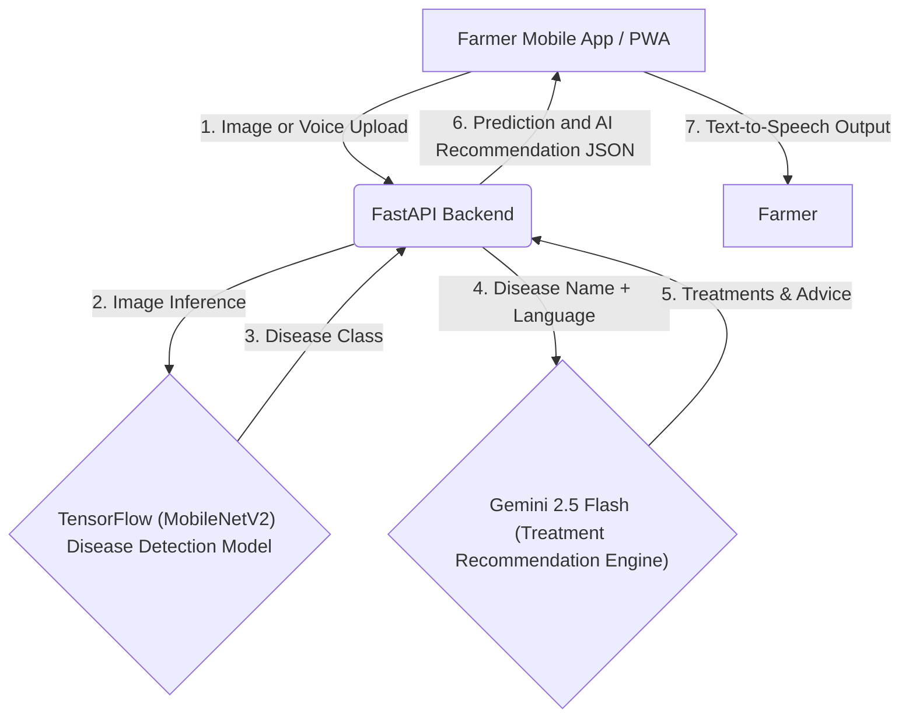

    

## 🌾 KrishiRakshak AI - AI-Powered Smart Farming Assistant

KrishiRakshak AI is a smart agricultural healthcare platform that enables farmers to detect crop diseases using Artificial Intelligence, Computer Vision, and Generative AI. Farmers can capture images of affected crops, describe symptoms via voice, and receive instant disease predictions along with preventive measures, organic, and chemical treatment recommendations.

Designed specifically for rural usability, the app features a Progressive Web App (PWA) architecture for mobile installation, full bilingual support (English and Hindi), and Text-to-Speech capabilities so advice can be listened to directly.

---
## Live Demo

App link: 
https://krishi-rakshak-ai-9l41.vercel.app/

Frontend:
https://krishi-rakshak-ai-9141.vercel.app/

---

## Deployed Features

- **🌱 AI-Powered Crop Disease Detection**: Snap a photo or upload an image to instantly classify plant diseases using a custom-trained TensorFlow model.
- **🤖 Gemini AI Advisory**: Generates highly personalized, context-aware advice for the detected disease (organic treatments, chemical treatments, and prevention).
- **🗣️ Voice-Enabled Search**: A "Tap to Speak" microphone feature allowing farmers to describe their crop issues out loud.
- **🔊 Text-to-Speech (Listen to Advice)**: The app can read the disease diagnosis and treatment advice aloud to the user in their preferred language.
- **🌐 Seamless Multilingual Support**: 100% bilingual interface with real-time translation of UI and Gemini AI responses into Hindi.
- **📱 Progressive Web App (PWA)**: Fully installable on iOS and Android home screens, looking and feeling exactly like a native mobile app.
- **📊 Interactive Dashboard**: A premium, beautifully designed responsive dashboard for farmers to track market prices (explore section) and disease alerts.

---

## 🛠️ Tech Stack

### Frontend (Farmer App)
- **Framework**: React.js (built with Vite)
- **Styling**: Vanilla CSS (Custom Design System, Glassmorphism, Micro-animations)
- **Icons**: Lucide React
- **Architecture**: Progressive Web App (PWA) with custom Service Workers

### Backend (API)
- **Framework**: FastAPI (Python)
- **Server**: Uvicorn

### AI & Machine Learning
- **Computer Vision**: TensorFlow/Keras image classification model (MobileNetV2 transfer learning)
- **Generative AI**: Google Gemini 2.5 Flash (for dynamic advisory generation and translation)
- **Speech API**: Web Speech API (for voice-to-text and text-to-speech)

### Deployment & Cloud
- **Frontend Hosting**: Vercel (PWA Deployment)
- **Backend Hosting**: Render (FastAPI Web Service)
- **Version Control**: Git & GitHub

---

## System Architecture

## Architecture Highlights

• FastAPI REST Backend

• TensorFlow MobileNetV2 Disease Classification

• Gemini 2.5 Flash Recommendation Engine

• Progressive Web App

• Voice Input + Text-to-Speech

• Multilingual Translation

• Cloud Deployment (Vercel + Render)

---

## Objectives

- **Empower Farmers**: Bridge the gap between rural farmers and expert agricultural knowledge.
- **Early Detection**: Enable immediate detection of crop diseases directly through smartphones.
- **Accessible Technology**: Overcome literacy barriers using Voice Input and Text-to-Speech.
- **Sustainable Farming**: Provide actionable organic treatment options alongside traditional chemical methods.

---
## UI Preview
1. Login Page

2. Home

3. AI Prediction

4. Prediction in Hindi

5. Explore Section

## 👩‍💻 Author
**Sneha** 
*Computer Science Undergraduate* 
**Open to AI/ML & Software Engineering Internship Opportunities.**
