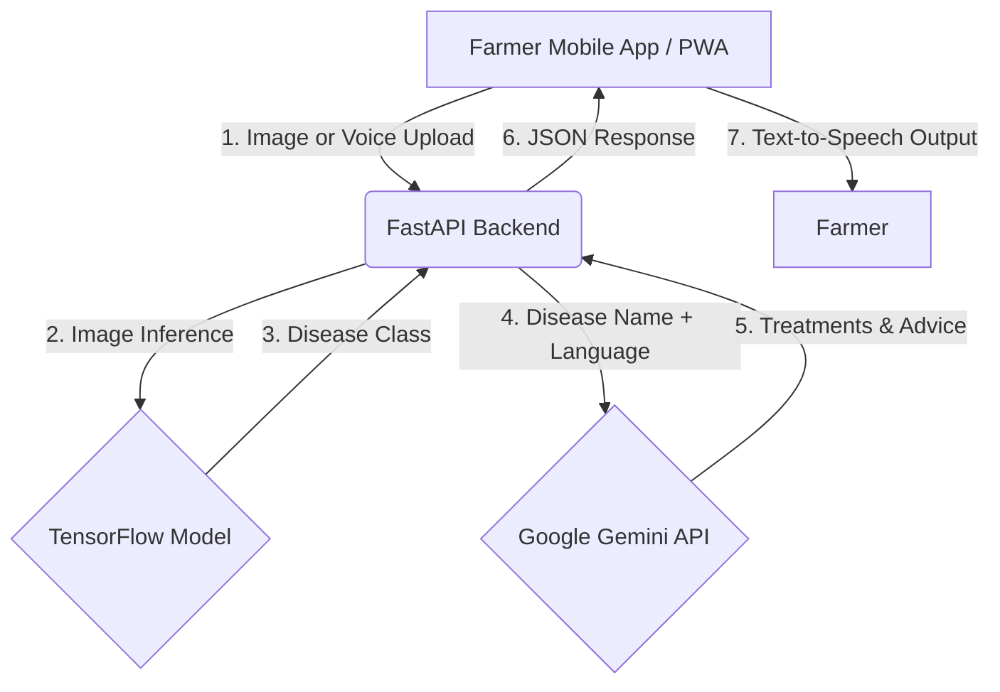

# 🌾 KrishiRakshak AI -  An AI-Powered Crop & Livestock Disease Diagnosis and Reporting Platform

KrishiRakshak AI is a smart agricultural healthcare platform that enables farmers to detect crop diseases using Artificial Intelligence, Computer Vision, and Generative AI. Farmers can capture images of affected crops, describe symptoms via voice, and receive instant disease predictions along with preventive measures, organic, and chemical treatment recommendations.

Designed specifically for rural usability, the app features a Progressive Web App (PWA) architecture for mobile installation, full bilingual support (English and Hindi), and Text-to-Speech capabilities so advice can be listened to directly.

---

## 🚀 Deployed Features

- **🌱 AI-Powered Crop Disease Detection**: Snap a photo or upload an image to instantly classify plant diseases using a custom-trained TensorFlow model.
- **🤖 Gemini AI Advisory**: Generates highly personalized, context-aware advice for the detected disease (organic treatments, chemical treatments, and prevention).
- **🗣️ Voice-Enabled Search**: A "Tap to Speak" microphone feature allowing farmers to describe their crop issues out loud.
- **🔊 Text-to-Speech (Listen to Advice)**: The app can read the disease diagnosis and treatment advice aloud to the user in their preferred language.
- **🌐 Seamless Multilingual Support**: 100% bilingual interface with real-time translation of UI and Gemini AI responses into Hindi.
- **📱 Progressive Web App (PWA)**: Fully installable on iOS and Android home screens, looking and feeling exactly like a native mobile app.
- **📊 Interactive Dashboard**: A premium, beautifully designed responsive dashboard for farmers to track market prices and weather (UI/UX).

---

## 🛠️ Tech Stack

### Frontend (Farmer App)
- **Framework**: React.js (built with Vite)
- **Styling**: Vanilla CSS (Custom Design System, Glassmorphism, Micro-animations)
- **Icons**: Lucide React
- **Architecture**: Progressive Web App (PWA) with custom Service Workers

### Backend (API)
- **Framework**: FastAPI (Python)
- **Server**: Uvicorn
- **File Handling**: Multipart Uploads & temporary file processing

### AI & Machine Learning
- **Computer Vision**: TensorFlow & Keras (Custom CNN trained for plant disease classification)
- **Generative AI**: Google Gemini Pro API (for dynamic advisory generation and translation)
- **Speech API**: Web Speech API (for voice-to-text and text-to-speech)

### Deployment & Cloud
- **Frontend Hosting**: Vercel (PWA Deployment)
- **Backend Hosting**: Render (FastAPI Web Service)
- **Version Control**: Git & GitHub

---

## 🏗️ System Architecture

---

## 🎯 Objectives

- **Empower Farmers**: Bridge the gap between rural farmers and expert agricultural knowledge.
- **Early Detection**: Enable immediate detection of crop diseases directly through smartphones.
- **Accessible Technology**: Overcome literacy barriers using Voice Input and Text-to-Speech.
- **Sustainable Farming**: Provide actionable organic treatment options alongside traditional chemical methods.

---

## 👩‍💻 Developed By

**Sneha**  
*B.Tech Computer Science*
